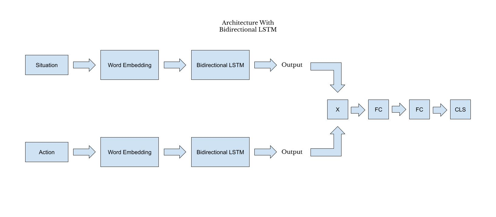
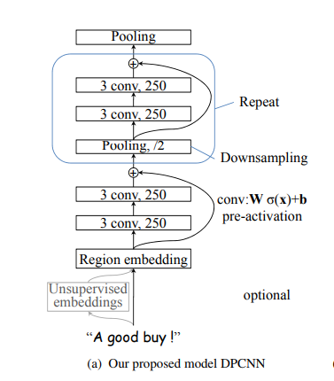
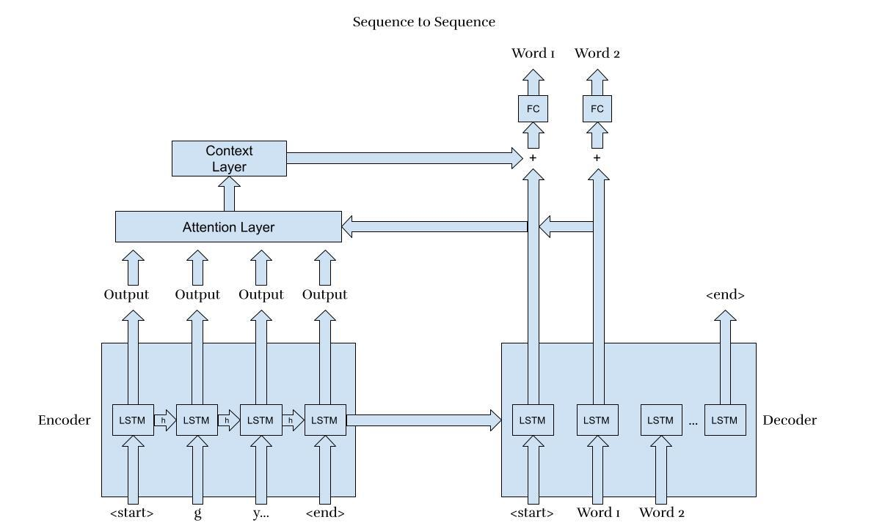

<!--
Name of your teams' final project
-->
# Prior for Value-Aligned Agent
## [National Action Council for Minorities in Engineering(NACME)](https://www.nacme.org) Google Applied Machine Learning Intensive (AMLI) at the `PARTICIPATING_UNIVERSITY`

<!--
List all of the members who developed the project and
link to each members respective GitHub profile
-->
## Team
- [Md Sultan Al Nahian](https://github.com/sultanalnahian) - `University of Kentucky` (Research Mentor)
- [Elizabeth Eyeson](https://github.com/lizagit) - `University of Colorado Boulder`
- [Kavisca Kuruparanantha](https://github.com/Kavisca) - `University of Kentucky`
- [Steven Aponte](https://github.com/StevenAponte815) - `Stevens Institute of Technology`

## Description
<!--
Give a short description on what your project accomplishes and what tools is uses. In addition, you can drop screenshots directly into your README file to add them to your README. Take these from your presentations.
-->
Goal-driven AI is susceptible to neglecting ethical concerns due to its blind prioritization of optimization in order to accomplish its goal with maximal performance. This project is a prior to a value-aligned agent that will be taught human values such that it will be trained to take actions that closer align with "normative" human behavior.

## Model Tasks
- **Classification:** Actions are classified as either normative or non-normative. Such classification is indicated by either a 0 (non-normative) or 1 (normative).
- **Sequence Generation:** Sequences describing the intentions behind actions taken are generated.

## Model Architectures
### Architecture With Bidirectional LSTM
- Implemented in `bidirectional-lstm.ipynb`
- Performs classification task

### DPCNN
- Implemented in DPCNN-master
- Developed by Rje Johnson and Tong Zhong [(original repository)](https://github.com/HaishuoFang/DPCNN)
- Performs classification task

### Seq2Seq
- Implemented in `seq-seq-learning-tensorflow.ipynb`
- Derived from Tensorflow documentation [(original documentation)](https://www.tensorflow.org/addons/tutorials/networks_seq2seq_nmt)
- Performs sequence generation task

## Requirements
- Command to install required libraries:
`pip install -r /path/to/requirements.txt`
- DPCNN code requires TensorFlow 1.14-1.19 and Python 3.6
- Bidirectional LSTM and Seq2Seq code require either Jupyter or Colab
- Seq2Seq code requires TensorFlow 2.0

## Usage Instructions
<!--
Give details on how to install fork and install your project. You can get all of the python dependencies for your project by typing `pip3 freeze requirements.txt` on the system that runs your project. Add the generated `requirements.txt` to this repo.
-->
### Architecture With Bidirectional LSTM
- Run `bidirectional-lstm.ipynb` in either Jupyter or Colab
### DPCNN
- Run `run.py` in `./DPCNN-master/DPCNN-master` in IDE supporting Python
### Seq2Seq
- Run `seq-seq-learning-tensorflow.ipynb` in either Jupyter or Colab